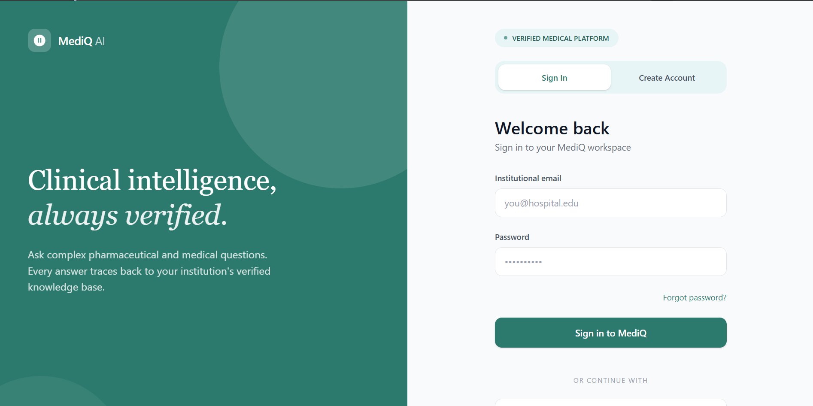
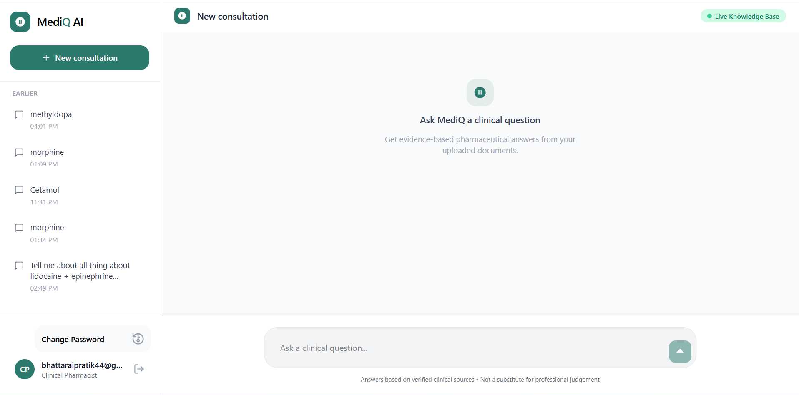
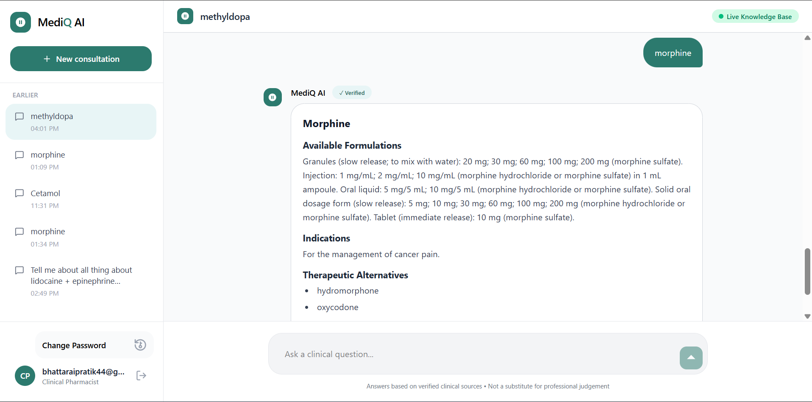
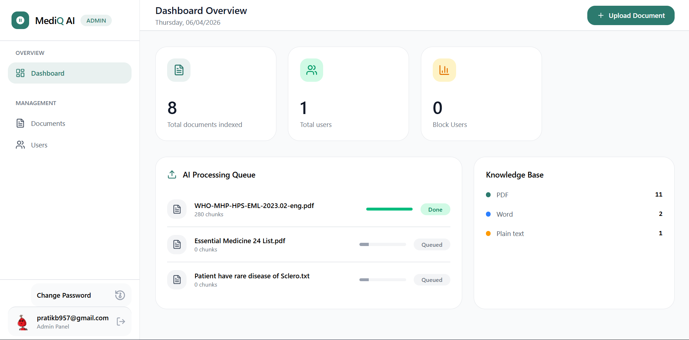
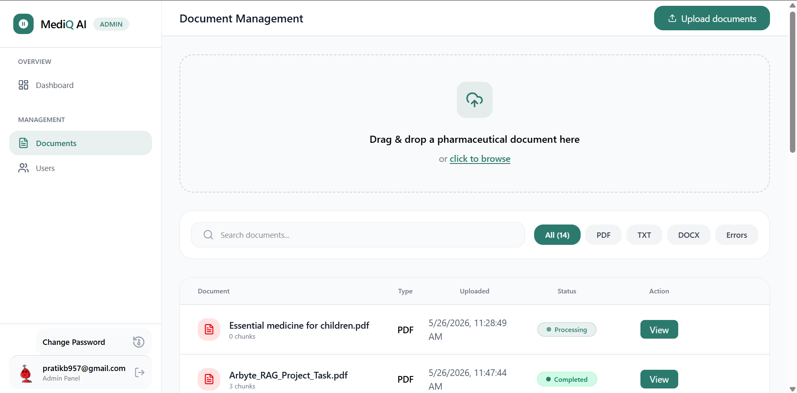
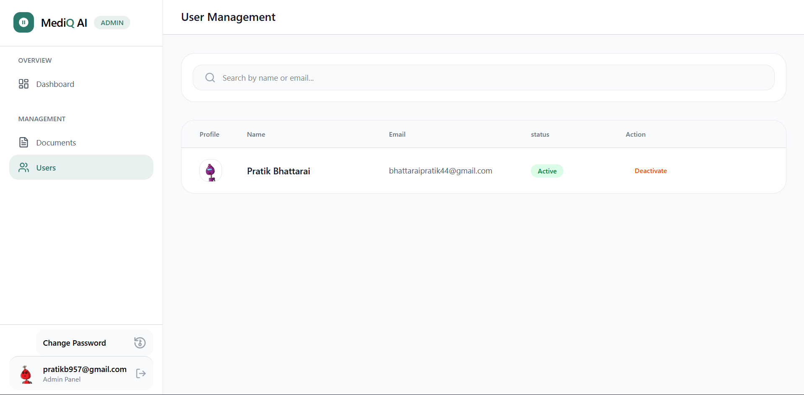

# MediQ Frontend

MediQ is a premium Clinical Decision Support System (CDSS) frontend designed to provide clinical pharmacists, researchers, and medical professionals with evidence-based answers extracted directly from clinical literature. Built on top of a robust Retrieval-Augmented Generation (RAG) backend, this React interface allows users to initiate chats, manage historical consultations, and enables administrators to ingest new pharmaceutical files while monitoring processing queues in real-time.

---

## Key Features

### 1. Clinical Chat Interface (`/dashboard`)
*   **Contextual RAG Q&A:** Submit complex medical queries to verify facts against indexed clinical guidelines and pharmaceutical catalogs.
*   **Verified Medical Responses:** AI responses feature detailed clinical citations rendered cleanly using **React Markdown**.
*   **Chronological Conversation Management:** Keep track of consultations with sidebar groups (e.g., *Today*, *Earlier*), dynamic title generation, and quick deletion controls.
*   **Smooth Interactions:** Fully optimized chat interface with immediate feedback state, loading spinners, and scroll-to-bottom features.

### 2. Admin Command Center (`/admin`)
*   **System Analytics:** High-level dashboard showcasing stats such as *Total Indexed Documents*, *Total Users*, and *Blocked/Suspended Users*.
*   **Real-time AI Processing Queue:** Direct visibility into the parsing, ingestion, and vectorization status of documents in the background queue.
*   **Active Knowledge Base Breakdown:** Visual report tracking file formats (PDF, DOCX, TXT) currently integrated into the vector database.

### 3. File Ingestion & Management (`/admin/documents`)
*   **Drag-and-Drop Uploader:** Fully integrated dropzone supporting drag-and-drop actions for files including `.pdf`, `.docx`, `.doc`, and `.txt`.
*   **Inline Queue Staging:** Preview files before triggering ingestion, complete with file type badges and validation details.
*   **Secure Storage Viewer:** Browse through all uploaded documents, trace parsing chunks, and click to securely view original files hosted via Cloudinary.

### 4. User Access Management (`/admin/users`)
*   **Audit Directory:** Comprehensive database of registered users showing their profile images, active roles, and system authorization status.
*   **Access Controls:** Toggle user statuses between **Active** and **Inactive** (suspended) to manage organization access instantly.

---

## Technology Stack

| Library / Framework | Purpose |
| :--- | :--- |
| **React 19** & **TypeScript** | Core application structure ensuring typed components, reusable interfaces, and reactive component lifecycles. |
| **Vite 8** | Ultra-fast build tool and bundler enabling instant Hot Module Replacement (HMR). |
| **Tailwind CSS v4** | Modern utility-first styling with inline native `@theme` tokens in [index.css](file:///d:/My%20Work/Rag%20Project/mediq-frontend/src/index.css). |
| **TanStack React Query v5** | Server state management, auto-caching, mutation handlers, and query invalidation. |
| **Zustand v5** | Lightweight, predictable client-state management for authentication sessions. |
| **React Router DOM v7** | Declarative client-side routing, protected routes, and admin layouts. |
| **Lucide React** | Consistent, modern vector iconography. |
| **React Dropzone** | Dynamic HTML5 file upload drag-and-drop listener. |
| **React Markdown** | Safe rendering of markdown strings and syntax highlighting for verified RAG citations. |
| **jwt-decode** | Secure decryption of JWT payload data for client role validation. |

---

## Project Architecture

The codebase follows a modular file architecture:

```text
mediq-frontend/
├── src/
│   ├── assets/          # Static assets, SVG logos, and visual elements
│   ├── components/      # Reusable UI widgets and layout views
│   │   ├── auth/        # Authentication components (LoginForm, etc.)
│   │   ├── chats/       # Chat pages sub-components (ChatMessage, etc.)
│   │   ├── layout/      # Shared wrappers (AdminLayout, Sidebar)
│   │   └── ui/          # Generic visual controls (Button, InputField, PopupModel, UploadModel)
│   ├── hooks/           # Custom React hooks (useAuth)
│   ├── lib/             # API client definitions and API handlers
│   │   ├── api.ts          # Core authentication client, JWT headers, auto-logout
│   │   ├── chatApi.ts      # Query submissions, chat room management
│   │   ├── dashboardApi.ts # Stats, queues, profiles, user lists
│   │   └── documentApi.ts  # Document lists, file uploads
│   ├── pages/           # High-level route views (ChatPage, LoginPage, AdminDashboard, etc.)
│   ├── routes/          # Navigation routers and Role Guards (AppRoutes, ProtectedRoutes)
│   ├── store/           # Zustand client state definitions (authStore)
│   ├── types/           # Global TypeScript declarations and interfaces
│   ├── App.tsx          # App base configuration & auth initializer
│   ├── index.css        # Tailwind config imports and custom theme values
│   └── main.tsx         # Document Object Model (DOM) mount point
```

---

## Installation & Setup

### 1. Prerequisites
Ensure you have the following installed on your machine:
*   [Node.js](https://nodejs.org/) (v18.x or above recommended)
*   [npm](https://www.npmjs.com/) (v9.x or above) or **Yarn**
*   Running **MediQ Backend Server** (defaults to `http://localhost:5000`)

### 2. Getting Started
Clone the repository and install the project dependencies:
```bash
# Clone the repository
git clone https://github.com/bhattaraiprati/MediQ-frontend.git
cd mediq-frontend

# Install dependencies
npm install
```

### 3. Running in Development
Start the local Vite development server:
```bash
npm run dev
```
The server will start, typically accessible at `http://localhost:5173`. Make sure the backend server is running concurrently at `http://localhost:5000` to handle user login, document uploading, and RAG chats.


---

##  API & Endpoint Configuration

The API base connection details are managed inside [api.ts](file:///d:/My%20Work/Rag%20Project/mediq-frontend/src/lib/api.ts):

*   **BASE_URL:** `http://localhost:5000/api`
*   **TOKEN_KEY:** `mediq_token`
*   **USER_KEY:** `mediq_user`

### JWT Interceptor and Authentication
Requests automatically attach the bearer token to requests using the `Authorization: Bearer <token>` header. If the server responds with a `401 Unauthorized` status (e.g. token expired), the frontend automatically logs out the user and redirects to the login page.

---


## Demo & Screenshots

### Login Page

### Chat Page

### Chat Response Page

### Admin Dashboard Page

### Admin Documents uplaod Page

### Admin Users Management Page


---